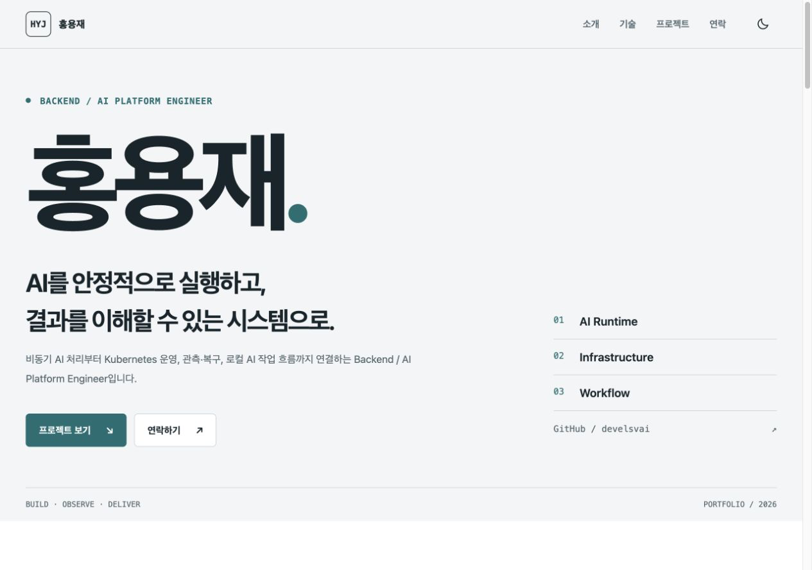
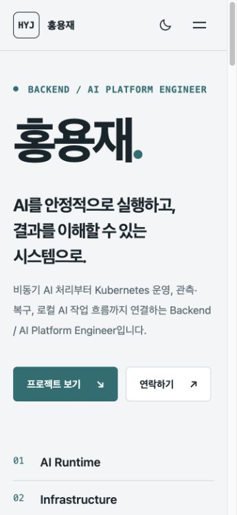
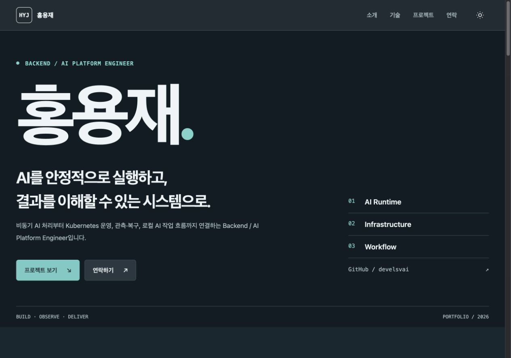

# 홍용재 포트폴리오

Backend / AI Platform Engineer 홍용재를 소개하는 모바일 퍼스트 단일 페이지입니다. 이력서와 기존 소개 사이트를 대조해, 기능 구현뿐 아니라 비동기 AI 처리·관측·복구·사람이 통제하는 작업 경계를 설명하도록 구성했습니다.

현재 상태: **로컬 구현 완료, Chrome 최종 확인 및 공개 배포 미완료**. 저장소/배포 URL 제출 과제 전체가 완료된 상태는 아닙니다.

- 현재 Git remote: [CodysseyHaru2/Codyssey_B1_1](https://github.com/CodysseyHaru2/Codyssey_B1_1) — 이번 변경은 push하지 않았습니다.
- GitHub Pages URL: 아직 없음. 배포 대상과 공개 범위 선택 후 기록합니다.
- 로컬 주소: `http://127.0.0.1:4173/` — 로컬 서버 실행 중에만 열립니다.
- [요구사항·콘텐츠 명세](docs/portfolio-spec.md), [실제 검증 기록](docs/verification.md).

## 기술과 파일 구조

순수 HTML5 / CSS3 / JavaScript ES6+만 사용합니다. 런타임 라이브러리, 프레임워크, 빌드 도구, API 토큰이 없습니다. 시스템 글꼴과 로컬 SVG를 사용합니다. 자동 테스트는 Node의 내장 `node:test` 및 VM으로 실행하며 사이트 런타임과 분리됩니다.

```text
index.html                 시맨틱 마크업과 소개·기술·연락 콘텐츠
css/style.css              변수, 테마, 모바일 퍼스트 레이아웃
js/main.js                 메뉴·테마·스크롤·Observer
js/projects.js             GitHub 요청 상태와 안전한 카드 렌더링
js/contact.js              폼 입력·검증·데모 확인
images/                    HYJ 이니셜 및 프로젝트 구조 요약도
tests/*.test.cjs            의존성 없는 자동 테스트
tests/browser-server.cjs   브라우저 QA 전용 대체 응답 서버
docs/portfolio-spec.md     출처와 요구사항 명세
docs/verification.md       시험 결과·한계·제출 체크리스트
docs/screenshots/          실제 로컬 화면 3종
.loom/                     로컬 작업 계약·결정·실행 기록 (배포 자산 아님)
```

## 로컬 실행

VS Code에서 이 폴더를 열고 Live Server 확장을 설치합니다. `index.html`에서 **Open with Live Server**를 선택합니다. HTML/CSS/JS를 저장한 뒤 브라우저를 새로고침해 확인합니다.

Python 3가 있으면 별도 패키지 없이 실행할 수 있습니다.

```sh
python3 -m http.server 4173 --bind 127.0.0.1
```

`http://127.0.0.1:4173/`를 엽니다. 종료는 해당 터미널의 Ctrl+C입니다. 로컬 서버는 폴더 전체를 제공하므로 외부 네트워크로 노출하지 않습니다. 공개 배포 자산은 `index.html`, `css/`, `js/`, `images/`만 선별해야 합니다. `.loom/`, PDF, 작업 로그는 Pages에 포함하지 않습니다.

## 기능과 설계

Hero / About / Skills / Projects / Contact / Footer를 갖췄습니다. `header`, `nav`, `main`, `section`, `article`, `footer`는 콘텐츠 역할과 탐색 구조를 표현합니다. 이미지에는 의미 있는 alt, 폼에는 label-for/id와 오류 설명 연결을 제공합니다. 공개 프로필 사진을 받지 않았으므로 HYJ 이니셜을 사용했습니다. 프로젝트 SVG는 구조 요약도이지 실제 장비 화면이나 실측 대시보드가 아닙니다.

CSS의 `:root`에서 색상·글꼴·간격을 공유하고 `[data-theme="dark"]`에서 색상만 바꿉니다. 한 방향으로 정렬하는 nav에는 Flexbox, 가용 폭에 맞춰 카드를 배치하는 Projects에는 `repeat(auto-fit, minmax(min(100%, 20rem), 1fr))` Grid를 사용합니다. 기본 단일 열에서 768px/1024px 이상으로 확장하며 hover/transition/shadow와 키보드 focus를 제공합니다.

### 6가지 인터랙션

| 기능 | 동작·기준 |
| --- | --- |
| 모바일 메뉴 | `active`와 `aria-expanded`를 같이 변경. 링크·Escape·768px 이상 복귀 시 닫기 |
| 섹션 이동 | 앵커 click의 기본 동작 제어 후 부드러운 이동, 대상 포커스와 URL hash 갱신 |
| 상단 버튼 | 스크롤 **300px 이상**에서 표시하고 맨 위로 이동 |
| 헤더 배경 | 스크롤 **60px 이상**에서 `scrolled` 적용 |
| 테마 | light/dark 전환, `portfolio-theme` localStorage 저장과 새로고침 복원 |
| 등장 효과 | IntersectionObserver **threshold 0.2**, 교차 비율 0.2 이상에서 표시 |

움직임 축소 환경에서는 smooth 이동/등장 애니메이션을 줄입니다. Observer 미지원에서는 모든 콘텐츠를 표시하며 localStorage 차단도 현재 테마 전환을 막지 않습니다. scroll 이벤트는 passive와 requestAnimationFrame으로 묶습니다.

### 이벤트 → 상태 → 렌더링

| 흐름 | 이벤트 | 상태 변경 | DOM 렌더 |
| --- | --- | --- | --- |
| 테마 (`main.js`) | theme 버튼 click | `state.theme` | `renderTheme`: data-theme·아이콘·버튼 안내·선택 저장 |
| 프로젝트 (`projects.js`) | 초기 요청 / retry click | `state.phase`, repos, error, missing | `render`: 로딩·상태 문구·카드·재시도·aria-busy |
| 폼 (`contact.js`) | input / submit | values, errors, phase | `renderField` / `renderStatus`: 인접 오류·aria-invalid·데모 성공 |

DOM은 querySelector/querySelectorAll로 선택하고 addEventListener로 연결합니다. 상태를 바꾸는 처리와 화면을 그리는 함수를 나눠 같은 상태가 일관된 화면을 만들도록 했습니다. const/let, 화살표 함수, 객체 구조분해, 템플릿 리터럴, map/forEach를 실제 렌더링과 이벤트 연결에 사용합니다. `var`, 인라인 onclick/style은 없습니다. JS 3개는 외부 파일이며 defer로 연결했습니다.

### GitHub API

`fetch` / `async-await` / `try-catch`와 response.ok 검사로 [사용자 공개 저장소 API](https://docs.github.com/en/rest/repos/repos#list-repositories-for-a-user)를 호출합니다.

```text
https://api.github.com/users/develsvai/repos?per_page=100&sort=pushed&page=1
```

100개가 있으면 다음 페이지를 읽습니다. 성공은 실제 데이터만, 빈 목록은 빈 안내만 표시합니다. 실패·403/429 요청 제한은 오류와 재시도를 제공하며 정적 대표 카드로 오류를 덮지 않습니다. 요청은 12초 후 중단되고 로딩 중 재시도는 무시해 중복을 막습니다.

비인증 요청의 기본 제한은 시간당 60회이므로 반복 새로고침을 피합니다. [GitHub 요청 제한 문서](https://docs.github.com/en/rest/using-the-rest-api/rate-limits-for-the-rest-api). 토큰을 공개 JS에 넣지 않습니다. 상태별 시험에는 제어된 대체 응답을 사용했습니다.

실제 이름이 일치하는 Loom→DeepQuest→TinyPilot-KVM-Docker에만 출처 있는 설명·이미지를 보강합니다. 2026-09-15 공개 응답에는 저장소 10개 중 TinyPilot-KVM-Docker만 일치했습니다. Loom/DeepQuest는 없는 카드나 가짜 메타데이터를 만들지 않고 누락 안내를 합니다. 나머지 저장소는 API description/language/stars/html_url/homepage와 fork 구분을 그대로 사용합니다. 설명·언어 누락에는 대체 안내를 제공합니다.

외부 데이터는 HTML escape, 링크는 http/https·공개 호스트 검사와 새 창 보안 속성을 적용합니다. 내부 IP·localhost·tailnet 장비 링크·자격증명 URL은 표시하지 않습니다. 링크 제공은 원 서비스의 독립 운영 검증이나 데모 접근 보장을 뜻하지 않습니다.

### 문의 폼

이름·이메일·메시지는 필수이고 공백도 빈 값으로 처리합니다. 제출 시 preventDefault로 새로고침을 막고, 오류를 필드 가까이에 표시하고 첫 오류에 포커스합니다. 입력을 수정하면 해당 오류와 이전 성공을 갱신합니다.

**학습용 입력 확인 폼이며 실제 전송되지 않습니다.** 외부 요청·메일 전송·localStorage 보관을 하지 않습니다. 성공도 "입력 내용을 확인했습니다. 이 데모에서는 메시지가 실제로 전송되지 않습니다."라고 안내합니다. 실제 연락은 공개 이메일 링크를 사용합니다.

## 검증과 스크린샷

Node 20+에서 추가 설치 없이 실행합니다.

```sh
node --check js/main.js
node --check js/projects.js
node --check js/contact.js
node --test tests/*.test.cjs
git diff --check
```

2026-09-15 자동 테스트 **20/20 통과**. 앱 브라우저에서 반응형 6폭, 테마 복원, 메뉴/앵커, 폼 오류·데모 성공, 실 API 성공과 요청 제한을 확인했습니다. 자동 테스트는 가벼운 DOM 대역으로 로직을 검사하므로 실제 Chrome 시험을 대신하지 않습니다. Chrome은 초기 빈 화면 후 실제 문서와 저장소 10개가 확인됐으나 UI 제어가 중단돼 기능·반응형·콘솔의 최종 확인은 미완료입니다.

공개 API 호출 없이 성공 카드와 빈/오류/403/로딩 UI를 실제 브라우저에서 시험하려면 다음 QA 전용 서버를 실행합니다.

```sh
node tests/browser-server.cjs
```

`http://127.0.0.1:4174/cases/success/`를 열고 `success` 대신 `empty`, `error`, `limited`, `loading`을 사용할 수 있습니다. 시험 서버가 메모리에서 API 주소만 로컬 대체 응답으로 바꿉니다. 실제 소스 파일과 4173 페이지를 변경하지 않으며 외부 API를 호출하지 않습니다. 샘플 저장소는 QA 전용이라고 표시하고 공개 배포에는 포함하지 않습니다. 종료는 Ctrl+C입니다.

아래는 **앱 브라우저 실제 viewport 캡처**이며 Chrome 캡처나 공개 배포 화면이 아닙니다.

데스크톱 (1280×900 설정, PNG 1265×889):



모바일 (360×780 설정, PNG 345×748):



다크 모드 (1280×900 설정, PNG 1265×889):



## 공개 전 남은 확인

- 안정된 Chrome에서 화면·기능·콘솔을 재검증하고 기록을 갱신합니다.
- 배포 대상 저장소, 공개 가능한 콘텐츠와 Git 기록 범위를 확인합니다. Git remote가 있다고 공개 승인을 가정하지 않습니다.
- GitHub Pages 게시 후 실제 저장소 URL/Pages URL, 상대 자산과 API·메뉴·폼 동작을 확인합니다.
- 원본 이력서·전화번호·미확정 프로젝트 기간·충돌하는 블로그 주소·실제 장비 접근 링크는 포함하지 않습니다.
- 성과의 독립 재측정을 하지 않았고, AI 완료 ops/s와 HTTP req/s 또는 목표값을 혼동하는 숫자 주장은 넣지 않았습니다.
